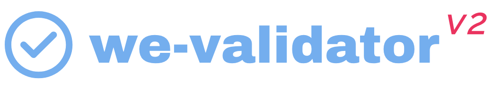
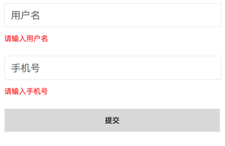

<p align="center">
  
</p>
<p align="center">
  <a href="https://travis-ci.org/ChanceYu/we-validator"></a>
  <a href="https://opensource.org/licenses/mit-license.php"></a>
  <a href="https://www.npmjs.com/package/we-validator"></a>
</p>

> 2.x 和 1.x 版本有所差别，如果您继续使用老版本，可以查看 [1.x 版本](https://github.com/ChanceYu/we-validator/tree/v1)。如果您要升级到 2.x 请先阅读[升级指南](./UPGRADE.md)，推荐使用 2.x 版本。

简单灵活的表单验证插件，支持小程序、浏览器、Nodejs。小程序端支持：微信、支付宝、百度智能、字节跳动，小程序默认提示使用 `showToast`。

[API 文档](#api) | [示例 Examples](#examples)，如果你 :sparkling_heart: 就点击 **★Star** 吧。

## 特点

- 使用简单灵活，不依赖任何框架
- 既支持原生小程序方式，也支持 mpvue、wepy、taro 等小程序框架使用
- 支持浏览器以及 Nodejs 端使用
- [支持自定义规则](#wevalidatoraddrulerulename-ruleoption)
- [支持自定义错误信息提示](#wevalidatoronmessage)
- [支持动态添加或移除字段校验](#addrulesoptions)
- [支持单独校验一个或多个字段规则](#checkfieldsdata-fields-onmessage)
- [支持函数校验](#wevalidatorcheckvaluerulename-value-param)
- [支持多个字段同时校验并显示错误](#多个字段同时校验并显示错误)
- [默认支持常用校验规则](#默认支持的规则)


## 安装
使用 npm:

```bash
npm install we-validator --save
```

使用 cdn:

```html
<script src="https://unpkg.com/we-validator/dist/we-validator.min.js"></script>
```


## 使用
下面是微信小程序的用法，其它小程序类似

<details open>
<summary>点击查看栗子 :chestnut: </summary>

```html
<form bindsubmit="onSubmitForm">
    <input type="text" name="username" placeholder="用户名" />
    <input type="number" name="phoneno" placeholder="手机号" />
    <input type="text" name="str" placeholder="长度为3的字符串" />

    <button type="default" formType="submit">提交</button>
</form>
```

```javascript
const WeValidator = require('we-validator')

Page({
    onReady(){
        this.initValidator()
    },
    onSubmitForm(e){
        let { value } = e.detail

        if(!this.validatorInstance.checkData(value)) return

        // 开始提交表单
        // wx.request
    },
    initValidator(){
        // 实例化
        this.validatorInstance = new WeValidator({
            rules: {
                username: {
                    required: true
                },
                phoneno: {
                    required: true,
                    mobile: true
                },
                str: {
                    length: 3
                },
            },
            messages: {
                username: {
                    required: '请输入用户名'
                },
                phoneno: {
                    required: '请输入手机号',
                    mobile: '手机号格式不正确'
                },
                str: { // 非必填字段
                    length: '请输入长度为3的字符串'
                },
            },
        })
    },
})
```

</details>

## Examples
您也可参考当前项目下对应示例

- [原生微信小程序使用方式](./example/wechat/pages/index/index.js)
- [mpvue 使用方式](./example/mpvue/src/pages/index/index.vue)
- [web 浏览器使用方式](./example/web/index.html)
- [Nodejs 端使用方式](./example/nodejs/server/router/home.js)
- [复杂的校验案例-自定义规则-动态添加字段校验](./example/complex/index.html)


## API
 - [new WeValidator(options)](#new-wevalidatoroptions)
    - [.checkData(data, onMessage)](#checkdatadata-onmessage) 校验数据，会显示错误信息
    - [.checkFields(data, fields, onMessage)](#checkfieldsdata-fields-onmessage) 校验数据，会显示错误信息，只校验对应的字段
    - [.isValid(data, fields)](#isvaliddata-fields) 校验数据，不会显示错误信息，可单独校验特定字段
    - [.addRules(options)](#addrulesoptions) 动态添加字段校验
    - [.removeRules(fields)](#removerulesfields) 动态移除字段校验


## Static API
 - [WeValidator](#static-api)
    - [.addRule(ruleName, ruleOption)](#wevalidatoraddrulerulename-ruleoption) 添加自定义规则
    - [.checkValue(ruleName, value, param)](#wevalidatorcheckvaluerulename-value-param) 函数校验，单独校验某个内容
    - [.onMessage](#wevalidatoronmessage) 设置全局错误信息显示


## 默认支持的规则

> 注意: 非必填字段只有字段有值才会校验配置的规则

| 规则 | 描述 | 默认提示 |
| --- | --- | --- |
| `required: true` | 必填 | 此字段必填 |
| `pattern: /^\d+$/` | 正则通用 | 不符合此验证规则 |
| `email: true` | 电子邮件格式 | 请输入有效的电子邮件地址 |
| `mobile: true` | 11位手机号 | 请输入11位的手机号码 |
| `tel: true` | 座机号<br>例如：010-1234567、0551-1234567 | 请输入座机号 |
| `url: true` | URL网址 | 请输入有效的网址 |
| `idcard: true` | 身份证号 | 请输入18位的有效身份证 |
| `equalTo: 'field'` | 字段值相同校验<br>例如：密码和确认密码，[参考](./example/web/index.html#L82) | 输入值必须和字段 `field` 相同 |
| `notEqualTo: 'field'` | 字段值不能相同校验<br>与 `equalTo` 相反 | 输入值不能和字段 `field` 相同 |
| `contains: 'str'` | 是否包含某字符 | 输入值必须包含 `str` |
| `notContains: 'str'` | 不能包含某字符 | 输入值不能包含 `str` |
| `length: 5` | 长度为多少的字符串 | 请输入 `5` 个字符 |
| `minlength: 2` | 最少多长的字符串 | 最少要输入 `2` 个字符 |
| `maxlength: 6` | 最多多长的字符串 | 最多可以输入 `6` 个字符 |
| `rangelength: [2, 6]` | 某个范围长度的字符串 | 请输入长度在 `2` 到 `6` 之间的字符 |
| `number: true` | 数字 | 请输入有效的数字 |
| `digits: true` | 正整数数字 | 只能输入正整数数字 |
| `integer: true` | 正整数或负整数数字 | 只能输入整数数字 |
| `min: 3` | 大于多少的数字<br>（最小只能多少），也可以比较字段的值，[参考](./example/complex/index.html#L180) | 请输入大于 `3` 的数字 |
| `max: 9` | 小于多少的数字<br>（最大只能多少），也可以比较字段的值 | 请输入小于 `9` 的数字 |
| `range: [3, 9]` | 大于且小于多少的数字 | 请输入大于 `3` 且小于 `9` 的数字 |
| `chinese: true` | 中文字符 | 只能输入中文字符 |
| `minChinese: 3` | 最少多少个中文字符 | 最少输入 `3` 个中文字符 |
| `maxChinese: 9` | 最多多少个中文字符 | 最多输入 `9` 个中文字符 |
| `rangeChinese: [3, 9]` | 大于且小于多少个中文字符 | 只能输入 `3` 到 `9` 个中文字符 |
| `date: true` | 日期（默认使用 `new Date(value)` 校验） | 请输入有效的日期 |
| `dateISO: true` | 日期（ISO标准格式）<br>例如：2019-09-19，2019/09/19 | 请输入有效的日期（ISO标准格式） |
| `ipv4: true` | ipv4地址 | 请输入有效的IPv4地址 |
| `ipv6: true` | ipv6地址 | 请输入有效的IPv6地址 |


## new WeValidator(options)
> 实例化

**返回**: <code>object</code> -  <code>validatorInstance</code>

| 参数 | 类型 | 默认值 | 描述 |
| --- | --- | --- | --- |
| options | <code>object</code> |  |  |
| [options.rules] | <code>object</code> |  | 验证字段的规则 |
| [options.messages] | <code>object</code> |  | 验证字段错误的提示信息 |
| [options.onMessage] | <code>function</code> |  | 错误信息显示方式<br>默认会自动检测环境。小程序默认使用`showToast`<br>普通web浏览器默认使用`alert`<br>Nodejs端不做处理建议自己配置，[详情](#wevalidatoronmessage) |
| [options.multiCheck] | <code>boolean</code> | `false` | 是否校验多个字段<br>需要一次校验多个字段并显示错误信息时使用，[详情](#多个字段同时校验并显示错误) |

<details>
<summary>点击查看栗子 :chestnut: </summary>

```javascript
const WeValidator = require('we-validator')

new WeValidator({
    rules: {
        username: {
            required: true
        },
        phoneno: {
            required: true,
            mobile: true
        }
    },
    messages: {
        username: {
            required: '请输入用户名'
        },
        phoneno: {
            required: '请输入手机号',
            mobile: '手机号格式不正确'
        }
    }
})
```

</details>

### .checkData(data, onMessage)
> 校验数据，会显示错误信息，校验所有字段规则

**返回**: <code>boolean</code>

| 参数 | 类型 | 默认值 | 描述 |
| --- | --- | --- | --- |
| data | <code>object</code> |  | 需要校验的表单数据 |
| onMessage | <code>function</code> |  | 自定义错误信息提示，[详情](#wevalidatoronmessage) |

### .checkFields(data, fields, onMessage)
> 校验数据，会显示错误信息，只校验对应的字段，[参考](./example/mpvue/src/pages/index/index.vue)。

通常用于单独校验一个或多个字段规则

**返回**: <code>boolean</code>

| 参数 | 类型 | 默认值 | 描述 |
| --- | --- | --- | --- |
| data | <code>object</code> |  | 需要校验的表单数据 |
| fields | <code>array</code> |  | 校验的字段规则，必填<br>例如：<br>`['phoneNo']` 只校验此字段的所有规则<br>`['phoneNo:required']` 只校验此字段的 `required` 规则<br>`['phoneNo:required,mobile']` 只校验此字段的 `required` 和 `mobile` 规则<br>`['phoneNo', 'code']` 只校验这两个字段的所有规则 |
| onMessage | <code>function</code> |  | 自定义错误信息提示，[详情](#wevalidatoronmessage) |

### .isValid(data, fields)
> 校验数据是否有效，不会提示错误信息

使用场景例如：表单中某些字段校验通过按钮才可点击的场景，[参考](./example/mpvue/src/pages/index/index.vue)。

**返回**: <code>boolean</code>

| 参数 | 类型 | 默认值 | 描述 |
| --- | --- | --- | --- |
| data | <code>object</code> |  | 需要校验的表单数据 |
| fields | <code>array</code> |  | 校验的字段<br>不传，默认校验所有字段规则<br>如果有，只校验对应的字段规则<br>配置方法同 `.checkFields(data, fields)` |

### .addRules(options)
> 动态添加字段校验，[参考](./example/complex/index.html#L235)

| 参数 | 类型 | 默认值 | 描述 |
| --- | --- | --- | --- |
| options | <code>object</code> |  | 同 `new WeValidator(options)` ，[详情](#new-wevalidatoroptions) |


<details>
<summary>点击查看栗子 :chestnut: </summary>

```javascript
const WeValidator = require('we-validator')

const validatorInstance = new WeValidator({
    rules: {
        username: {
            required: true
        }
    },
    messages: {
        username: {
            required: '请输入用户名'
        }
    }
})

// 动态添加校验
validatorInstance.addRules({
    rules: {
        phoneno: {
            required: true,
            mobile: true
        }
    },
    messages: {
        phoneno: {
            required: '请输入手机号',
            mobile: '手机号格式不正确'
        }
    }
})
```

</details>

### .removeRules(fields)
> 动态移除字段校验，[参考](./example/complex/index.html#L235)

| 参数 | 类型 | 默认值 | 描述 |
| --- | --- | --- | --- |
| fields | <code>array</code> |  | 需要移除校验的表单字段 |

```javascript
validatorInstance.removeRules(['username'])
```

## WeValidator.addRule(ruleName, ruleOption)
> 静态方法：添加自定义规则，[参考](./example/complex/index.html)

| 参数 | 类型 | 默认值 | 描述 |
| --- | --- | --- | --- |
| ruleName | <code>string</code> |  | 规则名称 |
| ruleOption | <code>object</code> |  | 规则配置 |
| [ruleOption.message] | <code>string</code> |  | 默认错误信息文字<br>可以动态插入参数，例如 `请输入长度在 {0} 到 {1} 之间的字符`，[参考](./src/rules.js#L127) |
| [ruleOption.rule] | <code>function\|regexp</code> |  | 规则校验函数，需要返回一个 `boolean`。<br>也可以直接写一个正则表达式（如果只是正则类型的校验）。 |

<details>
<summary>点击查看栗子 :chestnut: </summary>

```javascript
const WeValidator = require('we-validator')

// 添加自定义规则（这两种写法一样）
WeValidator.addRule('theRuleName', {
  message: '默认错误信息文字',
  rule(value, param){
    return /\d/.test(value)
  }
})
WeValidator.addRule('theRuleName', {
  message: '默认错误信息文字',
  rule: /\d/
})

// 使用方式一，实例化
new WeValidator({
    rules: {
        field1: {
            theRuleName: true
        }
    },
    messages: {
        field1: {
            theRuleName: '提示信息'
        }
    }
})

// 使用方式二，调用函数
WeValidator.checkValue('theRuleName', 'str')
```

</details>


## WeValidator.checkValue(ruleName, value, param)
> 静态方法：函数校验

| 参数 | 类型 | 默认值 | 描述 |
| --- | --- | --- | --- |
| ruleName | <code>string</code> |  | 规则名称 |
| value | <code>string</code> |  | 需要校验的内容 |
| param | <code>any</code> |  | 传递给规则参数 |

支持所有[默认支持的规则](#默认支持的规则)，也支持自定义的规则。

```javascript
 // 必填
let b1 = WeValidator.checkValue('required', 'str') // true

// 不能小于6的数字
let b2 = WeValidator.checkValue('min', 'str', 6) // false

// 大于2小于5的数字
let b3 = WeValidator.checkValue('range', 'str', [2, 5]) // false
```

## WeValidator.onMessage
> 自定义错误信息提示

可以全局配置一个，也可以单独配置，非常灵活。

优先级是：`.checkData(data, onMessage)` > `new WeValidator({ onMessage })` > `WeValidator.onMessage` > 默认检测

默认的消息提示方式：小程序默认使用`showToast`，浏览器默认使用`alert`，Nodejs端无处理建议自己配置。

<details>
<summary>点击查看栗子 :chestnut: </summary>

```javascript
const WeValidator = require('we-validator')

// 1、全局配置
WeValidator.onMessage = function(data){
    /*
    data 参数
    {
        msg, // 提示文字
        name, // 表单控件的 name
        value, // 表单控件的值
        param // rules 验证字段传递的参数
    }
    */
}

// 2、实例化配置
new WeValidator({
    rules: {},
    message: {},
    onMessage: function(data){
        alert(data.msg)
    }
})

// 3、验证的时候配置 onMessage（nodejs端校验可以使用此方式）
if(!obj.checkData(formData, onMessage)) return

function onMessage(data){
  alert(data.msg)
}
```

</details>

### 多个字段同时校验并显示错误
使用场景如下，**注意：当`multiCheck`为`true`时，建议使用自定义`onMessage`**，[参考](./example/web/index.html)



<details>
<summary>点击查看栗子 :chestnut: </summary>

```javascript
var validatorInstance = new WeValidator({
  multiCheck: true,
  onMessage: function(data){
    console.log(data);
    
    // 根据自己的项目去处理，控制错误信息的显示
  },
  rules: {
      username: {
          required: true
      },
      phoneno: {
          required: true,
          mobile: true
      }
  },
  messages: {
      username: {
          required: '请输入用户名'
      },
      phoneno: {
          required: '请输入手机号',
          mobile: '手机号格式不正确'
      }
  }
});
```

</details>

## Changelog
[查看更新日志](./CHANGELOG.md)

## Issues
如果您在使用过程中发现 Bug，或者有好的建议，欢迎[报告问题](https://github.com/ChanceYu/we-validator/issues)。

## License

[![license][img-mit]][url-mit]

Copyright (c) 2019 ChanceYu

[url-github]: https://github.com/ChanceYu/we-validator
[url-npm]: https://www.npmjs.com/package/we-validator
[url-travis]: https://travis-ci.org/ChanceYu/we-validator
[url-mit]: https://opensource.org/licenses/mit-license.php

[img-npm]: https://nodei.co/npm/we-validator.png?compact=true
[img-travis]: https://travis-ci.org/ChanceYu/we-validator.svg?branch=master
[img-javascript]: https://img.shields.io/badge/language-JavaScript-brightgreen.svg
[img-mit]: https://img.shields.io/npm/l/we-validator.svg

